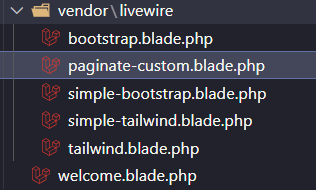

# cách dùng 

Sử dụng lệnh `paginate()` ở componet vào  `links()` ở view giống laravel, nhưng thêm `use WithPagination` để nó khỏi reload trang

```php
<?php

namespace App\Livewire;

use App\Models\User;
use Livewire\Attributes\Rule;
use Livewire\Component;
use Livewire\WithPagination;

class Clicker extends Component
{
    use WithPagination;


    public function render()
    {
        $title = "Test";
        $users = User::query()->paginate(5);
        return view('livewire.clicker', compact('title', 'users'));
    }
}
```
# Tùy chỉnh paginate

## bỏ qua url

Ví dụ url là `http://127.0.0.1:8000?page=2` mà không cần thay đổi URL. Thì sử dụng `WithoutUrlPagination` điều này cũng có nghĩa là trang hiện tại sẽ không được duy trì qua các lần thay đổi trang.

```php
<?php

namespace App\Livewire;

use App\Models\User;
use Livewire\Attributes\Rule;
use Livewire\Component;
use Livewire\WithoutUrlPagination;
use Livewire\WithPagination;

class Clicker extends Component
{
    use WithPagination, WithoutUrlPagination;

    public function render()
    {
        $title = "Test";
        $users = User::query()->paginate(5);
        return view('livewire.clicker', compact('title', 'users'));
    }
}

```


##  Thay tailwind thành bootstrap

Sử dụng lệnh để xuất file cấu hình, nó sẽ nằm ở `config/livewire`

```sh
php artisan livewire:publish --config
```

mở file cấu hình `config/livewire` và thay đổi

```php
    /*
    |---------------------------------------------------------------------------
    | Pagination Theme
    |---------------------------------------------------------------------------
    |
    | When enabling Livewire's pagination feature by using the `WithPagination`
    | trait, Livewire will use Tailwind templates to render pagination views
    | on the page. If you want Bootstrap CSS, you can specify: "bootstrap"
    |
    */

    'pagination_theme' => 'tailwind', // thay "bootstrap" vô và đang sử dụng bootstrap(có khai báo link hoặc cdn) là được
```

## Chỉnh lại chế độ xem

Sử dụng lệnh, nó sẽ tạo ra `views\vendor\livewire` 

```sh
php artisan livewire:publish --pagination
``` 

Nếu muốn nó hiện thị sao thì vô đó tạo file mới chỉnh sửa 

ví dụ: tạo mới paginate-custom



ở view dùng chỉ cần gọi tên

```php
{{ $users->links("vendor.livewire.paginate-custom") }}
```