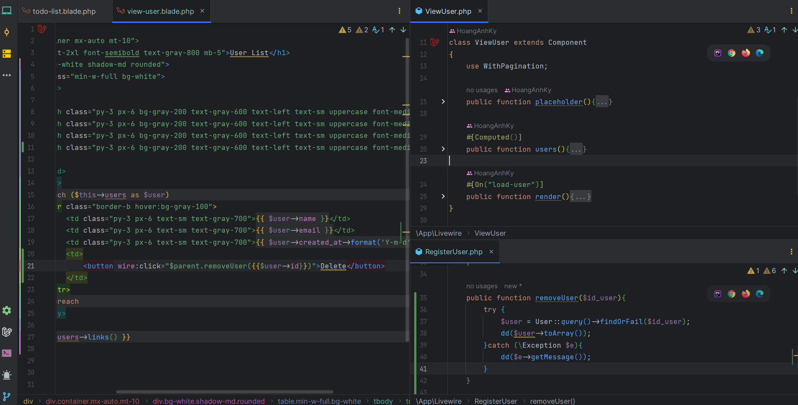

cho phép thực hiện các tác vụ chung trong các thành phần của mình mà không cần xác định các phương thức tùy chỉnh

# parent
### Mô tả

cho phép truy cập vào các thuộc tính của thành phần cha và gọi các hành động của thành phần cha từ thành phần con

### Ví dụ

```html
<button wire:click="$parent.removePost({{ $post->id }})">Remove</button>
```

nếu thành phần cha có `removePost()` hành động, thành phần con có thể gọi trực tiếp hành động đó từ mẫu Blade của nó bằng cách sử dụng `$parent.removePost()`

-  Trong Component `View User` không có action `removeUser` ngược lại bên trong `RegisterUser` có. cả 2 dùng chung view của `RegisterUser.blade.php` và dùng `$parent` của magic ation nên có thể xóa được như ví dụ

    

# set

### Mô tả

Cho phép cập nhật thuộc tính trong thành phần Livewire của nó trực tiếp từ mẫu Blade. Để sử dụng $set, hãy cung cấp thuộc tính muốn cập nhật và giá trị mới làm đối số

### Cú pháp

```html
// wire:click="$set('query', '')"
<button wire:click="$set('query', '')">Reset Search</button>
```

# refresh

### Mô tả 

tải lại trang 

### cú pháp 

```html
<!-- $refresh -->
wire:click="$refresh"
```

# toggle

### Mô tả

được sử dụng để chuyển đổi giá trị của thuộc tính boolean

### Cú pháp

```html
<button wire:click="$toggle('sortAsc')">
    Sort {{ $sortAsc ? 'Descending' : 'Ascending' }}
</button>
```
chuyển đổi giữa true và false

# dispatch

### Mô Tả 
Gửi sự kiện Livewire trực tiếp trong trình duyệt
### Cú pháp 

```html
<button type="submit" wire:click="$dispatch('post-deleted')">Delete Post</button>
```
# event

### Mô Tả 
cho phép truy cập vào sự kiện JavaScript thực tế đã được kích hoạt, cho phép tham chiếu đến phần tử kích hoạt và các thông tin liên quan khác

### Cú pháp 

```html
<input type="text" wire:keydown.enter="search($event.target.value)">
```