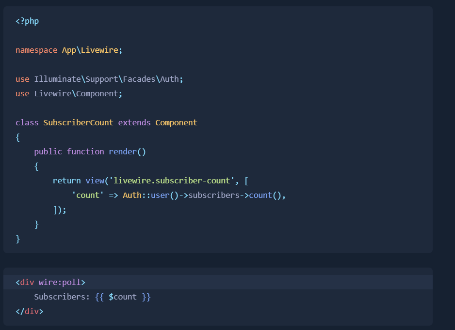

Dùng để lấy thông tin nhưng không reload trang



# `keep-alive`

Nếu ở trang đó thì nó mới cập nhật dữ liệu sau 2.5s thoát ra là không gửi nữa

```html
<div wire:poll.keep-alive>
```

# `visible`

chỉ chạy khi hiển thị trên trang nếu mà dùng nó ở trên mà scroll xuống cuối cũng không chạy

```html
<div wire:poll.visible>
```